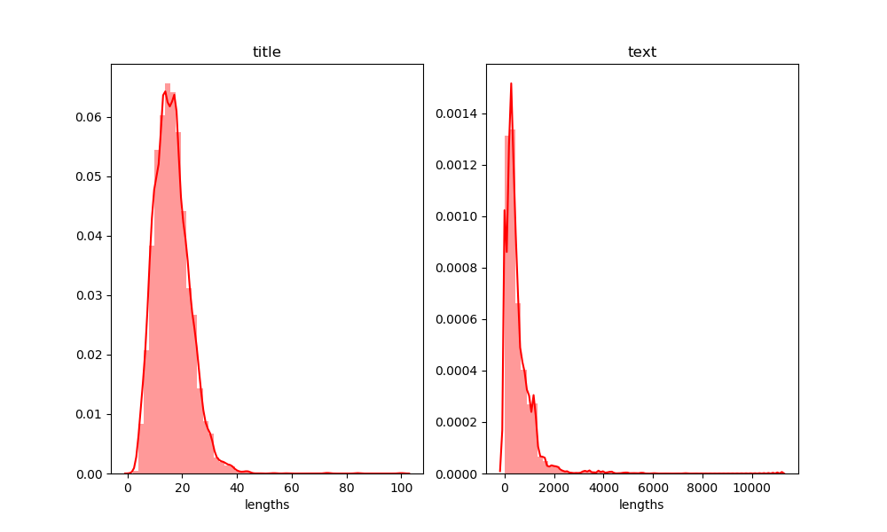

# CCF-BDCI-2019-Requirements-Achievements-Correlation
CCF BDCI 2019 “技术需求”与“技术成果”项目之间关联度计算模型 第9名解决方案

## 1.排名&分数
队伍：害，就这?

|           | A榜         | B榜   |
| ------------- |:-------------:| :-----:|
| 初赛      | 0.79600292/6 | 0.79499257/13 |
| 复赛       | 0.80414367/15 |   0.80107218/9 |

## 2.解决方案
### 数据样例
Requirements.csv样例:

``'13a581e1-2d7e-4c8d-b350-e3ab36dbe6a0' , '防爆锂离子电池的研发' , '随着社会的不断发展，锂电池的普及率越来越高，目前，国内锂离子电池产品存在安全隐患问题，为了满足客户及市场要求，结合本公司对锂电池防爆问题的研发经验积累，为了解决以上问题，特研发此项目。'``

Achievements.csv样例:

``'9782b000-822a-4591-b0c6-c41b19e7d6a9' , '水肥一体化智能监测与控制系统' , '1、技术特点：\n      1）神经元体系作为数字农业的新农具：由先进的传感器和物联网组成的神经元体系实时获取土壤、气象、作物、环境等资源环境信息；\n      2）平衡模型作为数字农业的新农技：知识算法成为数字农业的新农技，系统采用墒情预报模型、作物需水模型、灌溉模型、配方施肥模型等知识算法为水肥一体化提供智能决策，系统能够根据作物生长规律、作物生长环境要素结合知识算法为农业生产者提供灌溉、施肥的策略，何时灌溉、何时施肥、灌多少水、施多少肥，一切都在掌握中；\n      3）足不出户的远程操作，农业生产者通过水肥一体化系统，用手机就能远程开启阀门，不出门就能管理田地，能够获得种植的幸福感。\n2、技术参数：\n      1）供电电压：12DC/24VDC/220V；\n      2）输入接口：8路RS485；\n      3）输出接口：8路控制通道；\n      4）监测要素：流量、压力、CO2浓度、光照强度，空气温湿度，土壤温湿度，EC、PH，且可扩展其它传感器；\n      5）通信方式：本地RS485/LoRa,远程RJ45/4G；\n      6）显示：7寸/10寸液晶触摸屏；\n      7）控制方式：本地液晶触摸屏控制，远程WEB客户端和手机APP控制以及智能控制。\n3、应用范围：\n      水肥一体化智能监测与控制系统可应用于温室大棚水肥一体化、大田水肥一体化、果园水肥一体化等，涵盖粮食、果蔬、\n4、市场前景\n      原农业部发布的《推进水肥一体化实施方案（2016-2020年）》，在东北、西北、华北、西南、设施农业和果园六大区域，以玉米、小麦、马铃薯、棉花、蔬菜、果树六大作物为重点，推广水肥一体化技术，计划到2020年水肥一体化技术推广面积达到1.5亿亩。\n'``

Interrelation.csv样例:

``00072dfe-2d64-41fa-ac85-4ffeafc44df1,9782b000-822a-4591-b0c6-c41b19e7d6a9,1b547a46-0db7-4adc-9907-6be1e6bfa787,4``

Requirement和Achievement均以`(id, title, text)`三元组形式给出，任务是给定Requirement和Achievement的id(从而可以得到对应的title和text)，预测它们的相关程度(1-4)。

### 数据准备

分析title和text的长度分布(基于复赛Requirements.csv)发现，title在50以内而text比较长且方差大，并且实验发现加入text后训练时间增长且效果下降。因此在后续实验中**只使用title**。

此外，还发现训练集中存在冗余(同一样本多次出现)和标签不一致(输入相同，标签不同)的情况，这会导致交叉验证时由于验证集存在泄露，早停策略失效。针对这种情况，提出了三种处理方式：

1. 不作任何处理
2. 冗余数据只保留一份，标签不一致数据删除。
3. 不删除数据，但在做KFold时，把input相同的样本放入同一个fold中(冗余/标签不一致均这样处理)。

实验发现，**不做任何处理**本地CV及线上效果均比其他方法要好。(本地CV效果好不难理解，因为验证集中有泄露。<del>线上效果好可能是因为训练集和测试集都是从原始数据集中划分出来的，不进行处理从而训练集/测试集的分布是一致的</del>(只是我的猜测...))

